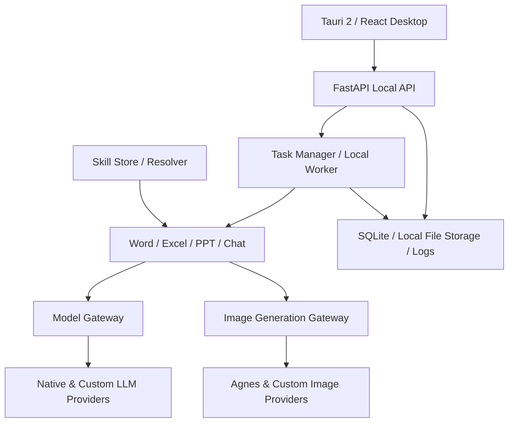

# OfficeAgent

> 面向 Windows 的本地优先 AI 办公桌面应用，用自然语言处理 Word、Excel 和 PowerPoint 工作流。

[](LICENSE)
[](pyproject.toml)
[](desktop-client/)

OfficeAgent 把本地 Office 文件、自然语言任务、可配置 AI Provider 和可复用 Skills 放进同一个桌面工作台。你可以上传文档或表格、描述目标、跟踪任务状态，并通过 Windows 原生保存对话框下载生成的 DOCX、XLSX 和 PPTX。

**当前源码版本：OfficeAgent 0.52.0**

## 核心功能

| 能力 | 可以完成的工作 |
| --- | --- |
| Word Agent | 文档排版、标题层级、字体与段落规范、表格处理、Markdown/文本转 DOCX、输出文件登记 |
| Excel Agent | XLSX/CSV 数据处理、汇总、公式、图表、多工作表分析、模板填充和 CSV 公式注入防护 |
| PPT Agent | 从主题、文本或 DOCX 生成 PPTX，使用模板、表格、图表和可选 AI 配图，并在配图失败时保留可用的演示文稿 |
| Chat / Task | 自然语言路由、异步任务、进度与结果、取消、上下文续改、revision 链和文件输出 |
| Provider | 原生模型预设、自定义 LLM/Image Provider、动态模型发现、连接测试、默认模型和故障转移 |
| Skills | 创建、导入、编辑和启停可复用指令；按 Agent 与 priority 确定性注入上下文 |
| Knowledge Base / RAG | 文档解析、分块、语义 Embedding、向量索引与检索；不可用时明确报错，不用伪结果掩盖失败 |
| Local data | SQLite、上传文件、输出文件、日志和加密模型配置默认保存在本机应用数据目录 |

## What's New in 0.52.0

### Custom LLM Providers

除原生 Provider 外，现在可以添加自己的模型服务：

- 自定义 Provider 名称、Base URL、API Key、模型列表和默认模型；
- 支持 **OpenAI Compatible** 与 **Anthropic Compatible** 协议；
- 保存前执行 **Test Connection**；
- 自动发现模型，也可手工添加未公开的 Model ID；
- API Key 留空时保留现有密钥，也可以显式清除；
- 可显式允许由用户控制的 localhost 或私网兼容端点。

这让兼容的第三方网关或自建服务无需逐个硬编码到 OfficeAgent。兼容性仍取决于目标服务是否实现对应协议。

### Dynamic Model Discovery

OfficeAgent 会优先请求 Provider 的 `GET /models` 并解析模型列表。若服务没有开放该端点、响应格式不同或当前 Key 无权限读取，仍可使用 **Manual Add Model** 填写实际 Model ID，不会因为发现失败而阻止保存兼容配置。

### Custom Image Providers

PPT 配图不再只绑定 Agnes：

- 保留内置 Agnes 配置；
- 支持 **OpenAI Image Compatible** Provider；
- 支持模型发现、手工模型和默认图片 Provider；
- 接受图片 URL 与 `b64_json` 两种响应；
- Provider 不可用、超时或限流时，PPT 任务保留模板/内容布局，并返回明确的配图状态和警告。

### Native Desktop Download

桌面端下载不再依赖浏览器新窗口。点击“下载”后，OfficeAgent 获取后端文件内容、打开 Windows 原生 **Save As** 对话框，再写入用户选择的位置。

该流程适用于 DOCX、XLSX、PPTX 和中文文件名，并提供取消、写入失败、打开文件及打开所在文件夹等状态。

### Skills

Skill 是一组**可复用的 Agent 指令和工作偏好**，例如极简商务 PPT、学术报告格式、财务分析规则或团队文档风格。

0.52.0 支持：

- 在 Skills 页面创建、编辑、删除和启用/禁用；
- 导入 UTF-8 Markdown Skill；
- 指定 `word`、`excel`、`ppt`、`chat` 或 `all`；
- 使用 `priority` 控制稳定的应用顺序；
- 对单个 Skill 和合并上下文执行长度限制。

Skill 当前是 instruction-based 能力，不是 Shell、Python 或任意代码插件，也不会授予额外的文件、网络、工具或凭据权限。

## 架构



桌面端默认连接 `127.0.0.1:8765`。安装版由 Tauri 管理 frozen backend 生命周期；开发版使用同一 FastAPI 和任务处理主链。

## Supported Office Workflows

### Word Agent

- 读取和生成 DOCX；
- 将 TXT、Markdown 等文本内容转换为 DOCX 工作流；
- 应用标题、正文、字体、字号、段落、缩进和表格规则；
- 通过结构检查与质量结果确认输出；
- 将生成结果登记为独立文件，保留原始上传文件。

### Excel Agent

- 读取 XLSX 和常见编码的 CSV；
- 分析数据结构、工作表、区域和字段；
- 生成或应用公式、汇总和图表；
- 支持多 Sheet 与模板结构；
- CSV 转 XLSX 时对可能触发公式执行的文本做防护。

### PPT Agent

- 根据主题、文本或 DOCX 内容生成 PPTX；
- 支持业务模板、颜色、字体、版式、表格和图表；
- 可调用所选 Image Provider 生成配图；
- 配图失败时记录 `image_generation` 状态并降级，不把失败静默伪装成已生成图片；
- 对页数和生成图片数量设有边界。

### Chat / Task System

- 根据自然语言和附件自动选择合适的 Agent；
- 使用 `queued`、`running`、`success`、`failed`、`cancelled` 等状态展示任务生命周期；
- 支持取消、历史记录、同一 conversation 的 follow-up 和 revision；
- 任务完成后返回可保存的输出文件。

## AI Provider Configuration

### Built-in Providers

原生预设继续支持 OpenAI、DeepSeek、Anthropic Claude、豆包、通义千问、Google Gemini 和 Agnes。原生预设提供少量默认模型，实际可用模型取决于你的账号、区域和 Provider 服务。

### Custom OpenAI-Compatible Provider

```text
Provider Name: My API
Protocol: OpenAI Compatible
Base URL: https://example.com/v1
API Key: ********
```

配置步骤：

1. 点击 **Test Connection** 检查地址、认证和协议；
2. 点击 **Detect Models** 请求 `/models`；
3. 选择默认模型；
4. 如果发现失败，使用 **Manual Add Model** 填写 Model ID；
5. 保存并启用 Provider。

Anthropic-compatible 服务使用相同流程，但聊天端点和认证头按 Anthropic 协议处理。

### Local Compatible Endpoints

Custom Provider 可以连接用户显式允许的 localhost 或私网兼容端点，适用于自行管理的本地 OpenAI/Anthropic-compatible 服务。该开关不代表对 Ollama、LM Studio 或任一具体产品的完整兼容承诺；请使用 Test Connection 验证实际端点。

链路本地、元数据、未指定、多播和保留地址仍受安全策略限制。

### Custom Image Provider

```text
Provider Name: My Image API
Protocol: OpenAI Image Compatible
Base URL: https://images.example.com/v1
API Key: ********
Model: my-image-model
```

图片 Provider 同样支持 Test Connection、模型发现和手工 Model ID。兼容端点应实现 `/images/generations`，并返回图片 URL 或 `b64_json`。

## Skills

下面的文件可直接作为 Markdown Skill 导入：

```markdown
---
name: 极简商务PPT
description: 用于商务汇报
agents:
  - ppt
priority: 100
---

# Instructions

- 每页只表达一个核心观点
- 每页不超过 5 个要点
- 优先使用图表
- 避免大段文字
- 最后一页输出 3 条结论
```

当前 parser 识别 `name`、`description`、`agents` 和 `priority`。导入文件必须为 UTF-8 `.md`、包含闭合 frontmatter，且不能超过 256 KB。UI 创建的 Instructions 最长 24000 字符；运行时单个 Skill 最多注入 6000 字符，全部 Skill context 最多 12000 字符。

Skill 的优先级低于系统安全策略和 Agent 核心约束，高于当前用户文件中的不可信内容。较小的 `priority` 数字会更早应用。

## Installation

### 普通用户

OfficeAgent 面向 Windows 桌面环境。安装包会在可用时通过 GitHub Releases 提供；当前开发构建不会自动发布，也不应把仓库中的调试产物当作正式安装包。

Windows 桌面端使用 WebView2；正式 NSIS 配置采用 WebView2 offline installer 模式。核心 DOCX/XLSX/PPTX 生成由 Python Office 文件库完成，不强制安装 Microsoft Office。Word、WPS 或 PowerPoint 可用于人工查看和继续编辑结果；LibreOffice 是增强文档/PPT 视觉渲染与检查的可选依赖，缺失时相关检查会降级。

## Quick Start

1. 安装并打开 OfficeAgent；
2. 进入“模型与生图服务”或“设置”；
3. 配置至少一个可用的 Model Provider 并选择默认模型；
4. 可选：配置 Image Provider 或创建 Skills；
5. 上传 Word、Excel、PPT、CSV 或文本文件；
6. 用自然语言描述目标并等待任务完成；
7. 点击“下载”，通过 Windows Save As 保存生成结果。

应用数据默认保存在 `%APPDATA%\OfficeAgent`。使用云端 Provider 时，任务所需的提示词、文档内容或图片请求可能发送给该 Provider。

## Development

### Requirements

- Python 3.10 或更高版本；
- Node.js 22；
- pnpm（CI 使用 pnpm 11）；
- Rust/Cargo（开发 Tauri 桌面端时需要）。

### Backend

```powershell
py -3.12 -m venv .venv
./.venv/Scripts/Activate.ps1
python -m pip install --upgrade pip
python -m pip install -e ".[dev]"
python -m office_agent.api.main
```

本地 API 默认地址为 `http://127.0.0.1:8765`，Swagger UI 位于 `/docs`，就绪检查位于 `/ready`。

如需本地 sentence-transformers embedding，可安装可选依赖：

```powershell
python -m pip install -e ".[dev,semantic]"
```

### Frontend and Tauri

```powershell
pnpm --dir desktop-client install --frozen-lockfile
pnpm --dir desktop-client run dev
```

启动完整桌面开发实例：

```powershell
pnpm --dir desktop-client tauri dev
```

## Production Build

Windows 统一发布入口是 [desktop/build_windows.bat](desktop/build_windows.bat)。它按顺序执行 frozen backend、完整 SHA-256 release manifest 校验、Tauri 2 和 NSIS 构建：

```powershell
python -m pip install -r requirements-production.txt
pnpm --dir desktop-client install --frozen-lockfile
desktop\build_windows.bat
```

发布入口要求已跟踪工作树干净，并将 frozen backend manifest 绑定到当前完整 Git SHA。构建安装包并不等同于已经创建 GitHub Release、完成代码签名或通过 SmartScreen 声誉检查。

## Project Structure

```text
OfficeAgent/
├── office_agent/
│   ├── api/                    # FastAPI、路由和中间件
│   ├── database/               # SQLite、SQLAlchemy、Alembic 和 Repository
│   ├── model_gateway/          # 模型路由、原生/自定义 Provider 和故障转移
│   ├── image_generation/       # Agnes/自定义图片 Provider 统一网关
│   ├── skills/                 # Markdown parser、Skill Resolver 和 prompt 注入
│   ├── services/               # Word 与通用文档服务
│   ├── excel_agent/            # Excel 分析、公式、图表和模板
│   ├── ppt_agent/              # PPT 规划、生成、配图和质量检查
│   ├── knowledge_base/         # 文档分块、Embedding、索引和检索
│   ├── task_queue/             # Local Worker、调度器和任务实现
│   └── security/               # 认证、SSRF、Prompt、文件和审计边界
├── desktop-client/             # React 19、Vite 和 Tauri 2 桌面端
├── desktop/                    # Windows launcher 与发布链
├── tests/                      # 单元、集成、迁移、E2E 和发布链测试
├── docs/architecture/          # 架构决策与运行时说明
└── pyproject.toml              # Python 包与开发工具配置
```

## Security and Privacy

- API 默认绑定 `127.0.0.1`；
- 模型 API Key 使用本地主密钥加密落盘，API 只返回掩码；
- 自定义 Provider URL 经过协议、地址、DNS、重定向和响应大小检查；
- localhost/私网访问必须显式开启，敏感元数据地址仍会拒绝；
- 文件上传、下载和任务选项执行 owner、路径和大小边界检查；
- CSV 转换包含公式注入防护；
- Skill 不能授权代码执行或绕过系统安全策略；
- 错误信息和日志经过凭据、路径等敏感内容脱敏。

这些措施用于降低风险，不构成绝对安全保证。安全设计说明见 [Security README](office_agent/security/README.md) 和 [Accepted Design Decisions](docs/architecture/accepted_design_decisions.md)。

OfficeAgent 默认将数据库、文件和配置保存在本机。发送给已配置 AI Provider 的内容受相应 Provider 的服务条款和隐私政策约束；因此不能把“本地优先”理解为所有任务数据永不离开设备。

## Testing

项目测试覆盖：

- backend 单元、集成和回归测试；
- Alembic fresh/upgrade/downgrade/re-upgrade；
- Provider 配置、模型发现、连接、密钥加密和 SSRF 边界；
- Skill CRUD、Markdown 导入、预算和 Agent 注入；
- DOCX/XLSX/PPTX 生成与重新打开；
- React/Vitest、TypeScript、Oxlint 和 Vite production build；
- Rust/Tauri check、test 和 build；
- frozen backend manifest 与 Windows 发布链检查。

常用命令：

```powershell
python -m pytest -q
python -m mypy office_agent
# 与 CI 一致的 Ruff advisory 扫描
python -m ruff check office_agent/ --select=E,F --ignore=E501
pnpm --dir desktop-client run lint
pnpm --dir desktop-client run typecheck
pnpm --dir desktop-client run test
pnpm --dir desktop-client run build
cargo check --manifest-path desktop-client/src-tauri/Cargo.toml --locked
cargo build --manifest-path desktop-client/src-tauri/Cargo.toml --locked
```

README 不固定宣传某一次测试数量；当前状态以仓库 CI 和对应提交的验收记录为准。

## Known Limitations

- 复杂或内容极密的 PPT 仍可能需要人工调整分页、图表和视觉层级；
- 图片生成依赖用户配置的 Provider、模型、额度和网络，失败时会降级并报告状态；
- `.doc` 和 `.xls` 旧格式不在当前主处理链内，请先另存为 `.docx` 或 `.xlsx`；
- 未安装 LibreOffice 时，部分文档/PPT 视觉检查会降级为结构或文本检查；
- Custom Provider 只保证所列兼容协议边界，不保证每个第三方服务的私有扩展；
- Skills 是指令型扩展，不是可执行插件。

## Roadmap

- 更丰富、可分享的 Skill 生态；
- 更多经过验证的兼容 Provider；
- 更完善的 PPT 布局与复杂内容续页；
- Windows 安装包签名与分发体验完善。

Roadmap 表示方向，不承诺具体版本或日期。

## License

OfficeAgent 使用 [MIT License](LICENSE)。
